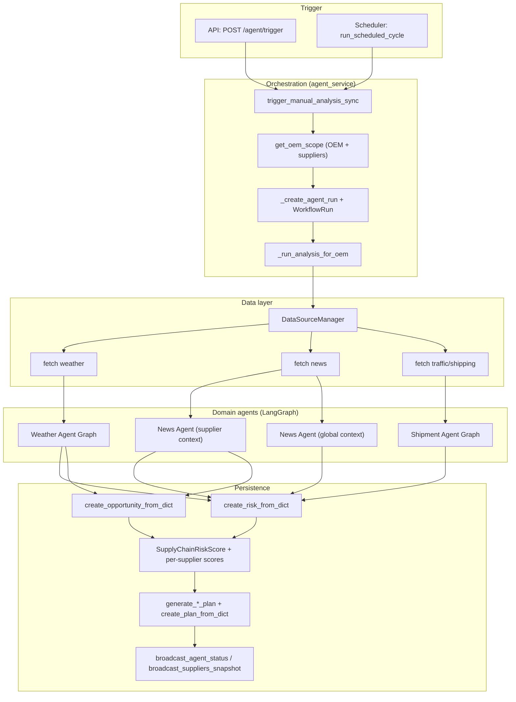
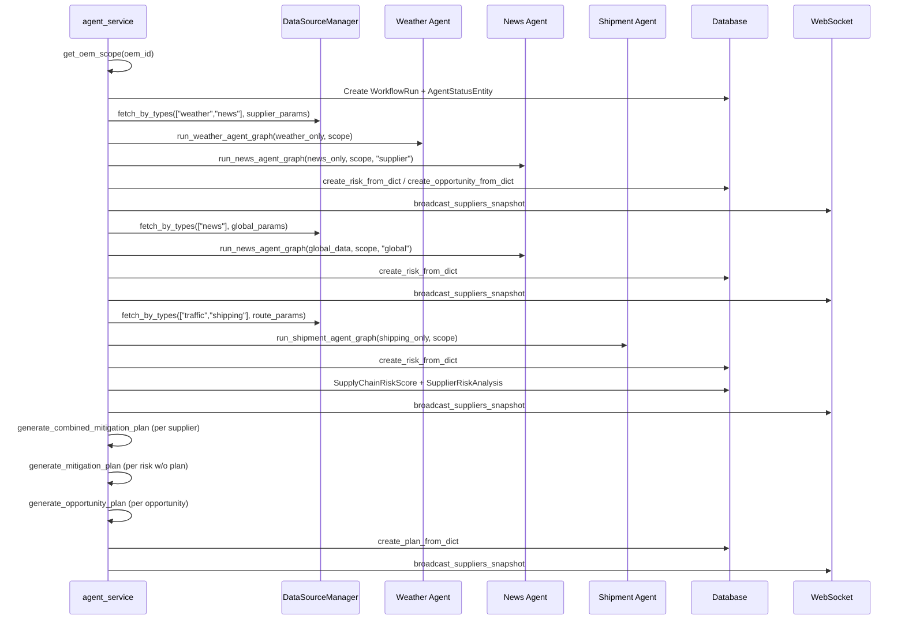
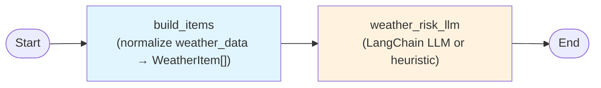
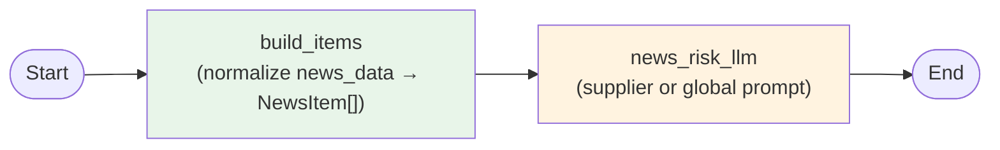
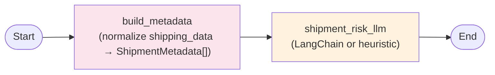
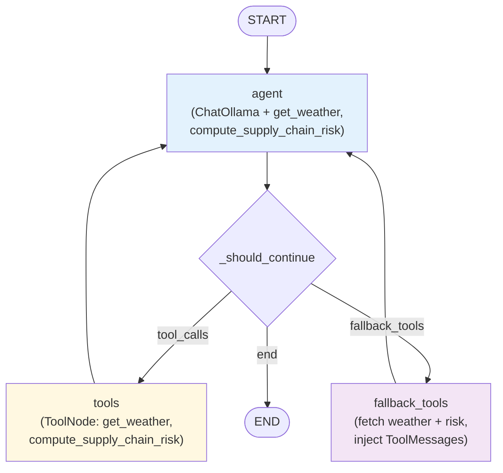

# Agent Workflow

This document describes the end-to-end agent workflow for supply chain risk analysis: how runs are triggered, how data is fetched, how domain agents (Weather, News, Shipment) run, and how risks, scores, and mitigation/opportunity plans are produced.

---

## 1. High-level flow

**Sequence summary**

1. **Trigger** — Manual via `POST /agent/trigger` (optional `oem_id`) or scheduled `run_scheduled_cycle(db, None)` (all OEMs).
2. **Orchestration** — `trigger_manual_analysis_sync` checks no run in progress, resolves OEM scope via `get_oem_scope`, creates `WorkflowRun` + `AgentStatusEntity`, then runs `_run_analysis_for_oem` per OEM.
3. **Data** — `DataSourceManager` fetches by type: weather, news, traffic/shipping (params from scope: cities, routes, keywords).
4. **Domain agents** — Weather and News (supplier) run on supplier-scoped data; News (global) on global news; Shipment on route/shipping data. Each returns risks (and opportunities where applicable).
5. **Persistence** — Risks/opportunities are stored; OEM-level and per-supplier risk scores are computed and saved; mitigation plans (combined + per-risk) and opportunity plans are generated via `agent_orchestrator` and stored; status/suppliers are broadcast over WebSocket.

---

## 2. Per-OEM analysis sequence (_run_analysis_for_oem)

---

## 3. Weather Agent Graph (LangGraph)

Defined in `backend/app/agents/weather.py`. Linear pipeline: normalize weather data → LLM/heuristic → risks + opportunities.

- **State:** `WeatherAgentState` (scope, weather_data, weather_items, weather_risks, weather_opportunities).
- **Entry:** `weather_data` (from DataSourceManager).
- **Output:** `risks` and `opportunities` with `sourceType: "weather"` and `sourceData.weatherExposure`.

---

## 4. News Agent Graph (LangGraph)

Defined in `backend/app/agents/news.py`. Same structure as Weather; context (supplier vs global) changes the prompt.

- **State:** `NewsAgentState` (scope, context, news_data, news_items, news_risks, news_opportunities).
- **Context:** `"supplier"` (OEM/supplier-focused) or `"global"` (macro supply chain risks).
- **Output:** `risks` and `opportunities` with `sourceType: "news"` and `sourceData.risk_type`, `context`.

---

## 5. Shipment Agent Graph (LangGraph)

Defined in `backend/app/agents/shipment.py`. Normalize shipping data → LLM or heuristic → shipping risks.

- **State:** `ShipmentAgentState` (scope, shipping_data, shipment_metadata, shipping_risks).
- **Output:** `risks` only, with `sourceType: "shipping"` and `sourceData.shipmentMetadata`, `riskMetrics` (delay_risk, stagnation_risk, velocity_risk). Affected suppliers are inferred from route/scope when building DB payload.

---

## 6. Legacy Weather Risk Agent (app/agent/graph.py)

Defined in `backend/app/agents/legacy_weather.py`. Used for single-city weather risk (e.g. “assess supply chain weather risk for city X”). Tool-calling loop: agent → tools or fallback_tools → back to agent until no tool calls.

- **State:** `AgentState` (messages, city, weather_data, risk_dict).
- **Tools:** `get_weather(city)`, `compute_supply_chain_risk(weather_key)`.
- **Entry:** `run_weather_risk_agent(city)` (from `app.agents.legacy_weather`) with system + user message.
- **Exit:** Final state with `weather_data`, `risk_dict`, and optional `llm_summary` (from last AI message or a fallback summary prompt).

---

## 7. Data flow summary

| Stage            | Inputs                          | Outputs / Next stage                    |
|-----------------|----------------------------------|-----------------------------------------|
| Trigger         | DB, optional oem_id             | Scope, WorkflowRun, AgentStatusEntity   |
| DataSourceManager | scope (cities, routes, keywords) | weather, news, shipping lists           |
| Weather Agent   | weather_data, scope             | risks, opportunities                    |
| News Agent      | news_data, scope, context       | risks, opportunities                    |
| Shipment Agent  | shipping_data, scope             | risks                                   |
| agent_service   | domain agent results            | create_risk_from_dict, create_opportunity_from_dict |
| Risk scoring    | All risks for OEM (this run)     | SupplyChainRiskScore, SupplierRiskAnalysis |
| Plans           | Risks / opportunities           | MitigationPlan, opportunity plans       |
| Broadcast       | DB state                        | WebSocket: agent_status, suppliers     |

---

## 8. File reference (grouped by workflow)

| Layer / Component      | Location |
|------------------------|----------|
| **Trigger**            | `backend/app/api/routes/agent.py` |
| **Orchestration**      | `backend/app/orchestration/agent_service.py` |
| **Data layer**         | `backend/app/data/` (manager.py, base.py, weather.py, news.py, traffic.py, market.py, shipping.py, trends.py, excel.py) |
| **Domain agents**      | `backend/app/agents/` (weather.py, news.py, shipment.py, legacy_weather.py) |
| **Persistence / plans** | `backend/app/services/agent_orchestrator.py`, `mitigation_plans.py`, `risks.py`, `opportunities.py` |
| **Broadcast**          | `backend/app/services/websocket_manager.py` |

Backward compatibility: `app.agent` re-exports `run_weather_risk_agent` and `run_weather_agent` from `app.agents`.
